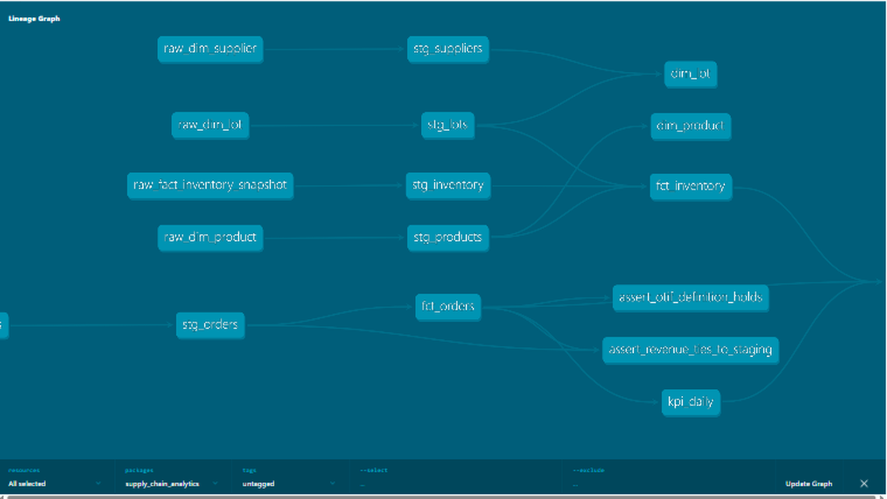

# Supply Chain Analytics — dbt

[](https://github.com/KushPatel29/supply-chain-analytics-dbt/actions/workflows/ci.yml)


The [Supply Chain Control Tower](https://github.com/KushPatel29/supply-chain-control-tower)
star schema, rebuilt the analytics-engineering way: dbt seeds → staging views
→ dimensional marts, with tests as the deployment gate, generated docs and
lineage, an exposure declaring the downstream Power BI report, and a
production-shaped Airflow DAG that CI structurally validates.

Runs locally on **DuckDB with zero setup** (`dbt build`, done) and carries a
production-shaped **Snowflake** target in the same profile — the SQL is
cross-database (dbt dispatch macros), so switching warehouses is a CLI flag,
not a rewrite.

## Lineage



```
seeds (raw ERP extracts)          staging (typed, renamed)        marts (star schema)
raw_fact_orders              ->   stg_orders                 ->   fct_orders  ->  kpi_daily
raw_fact_inventory_snapshot  ->   stg_inventory              ->   fct_inventory
raw_dim_*                    ->   stg_*                      ->   dim_product / dim_customer /
                                                                  dim_warehouse / dim_lot
```

Business logic lives in the marts: OTIF flag (on-time AND fill ≥ 95%),
revenue/margin, and FEFO expiry banding via the `expiry_band()` macro —
the same rules the Control Tower's PySpark Silver layer implements, so the
two repos double as a cross-engine consistency check.

## Run it (60 seconds, no warehouse needed)

```bash
pip install dbt-duckdb
dbt deps  --profiles-dir .
dbt build --profiles-dir .          # seed + run + test: 53 passing
dbt docs generate --profiles-dir . && dbt docs serve --profiles-dir .
```

### Run it on Snowflake

```bash
pip install dbt-snowflake
export SNOWFLAKE_ACCOUNT=... SNOWFLAKE_USER=... SNOWFLAKE_PASSWORD=...
dbt build --profiles-dir . --target snowflake
```

The `profiles.yml` ships both targets. Model SQL uses dbt cross-database
macros (`dbt.datediff`, `dbt_utils.*`), so no model changes are needed to
move between engines.

## Testing philosophy

| Layer | What's tested |
|---|---|
| Schema tests | `unique` / `not_null` keys on every model, `relationships` from fact to every dimension, `accepted_values` on flags |
| Expression tests | `qty_shipped <= qty_ordered`, `fill_rate between 0 and 1` (dbt_utils) |
| Singular tests | **Control total**: mart revenue must tie to revenue recomputed from staging to the penny. **Definition test**: every OTIF-flagged row actually satisfies the OTIF definition. |

`dbt build` won't ship marts whose tests fail — tests are the gate, not a
report.

## Advanced dbt features in use

| Feature | Where | Why it matters |
|---|---|---|
| **Incremental model** | `fct_orders` — `delete+insert` on `order_id` with a 7-day late-arrival reprocess window | The pattern that makes a 100M-row fact affordable: only new/changed days rebuild |
| **SCD Type 2 snapshot** | `snapshots/product_price_snapshot.sql` (`check` strategy on cost/price) | Repricing history is preserved, so margin can be recomputed as-of any order date |
| **Semantic layer (MetricFlow)** | `models/semantic/` — entities, measures, and governed metrics (`total_revenue`, `otif_rate` as a ratio metric) + time spine | Metric definitions live in code, not in each BI tool separately |
| **Analyses + findings memo** | `analyses/*.sql` + [`docs/INSIGHTS.md`](docs/INSIGHTS.md) | The "so what": four findings with reproducible numbers, incl. why this data is *not* 80/20 |
| **Containerized build** | `Dockerfile` — `docker run --rm sca-dbt` executes the full build; CI does exactly this | Anyone (and any scheduler) reproduces the build with zero local setup |

## Orchestration (Airflow)

[`orchestration/airflow/supply_chain_dbt_dag.py`](orchestration/airflow/supply_chain_dbt_dag.py)
is the nightly production DAG: `dbt deps → seed → run (staging → marts, as a
TaskGroup) → test`, with retries, an SLA on the marts build, and email on
failure. CI installs Airflow and **imports the DAG with a DagBag**, asserting
the task graph — a broken DAG fails the pull request, not the 6 a.m. run.

## Exposure

The marts declare a dbt **exposure** for the downstream Power BI report
(`supply_chain_control_tower_report`), so `dbt ls --select +exposure:...`
answers "what breaks upstream if I change this model?" — the lineage
question every BI team gets asked.

## Repo layout

```
seeds/                raw ERP extracts (synthetic, fixed seed, from the Control Tower repo)
models/staging/       typed/renamed views, 1:1 with sources
models/marts/         star schema: dims + facts + kpi_daily rollup
macros/               expiry_band() — FEFO risk banding, DRY across models
tests/                singular tests: control totals + OTIF definition
orchestration/airflow/  nightly DAG + DagBag integrity tests (run in CI)
profiles.yml          duckdb (default) + snowflake targets
.github/workflows/    CI: full dbt build on DuckDB + Airflow DAG validation
```
